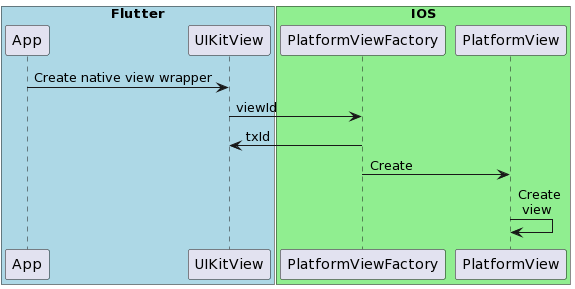
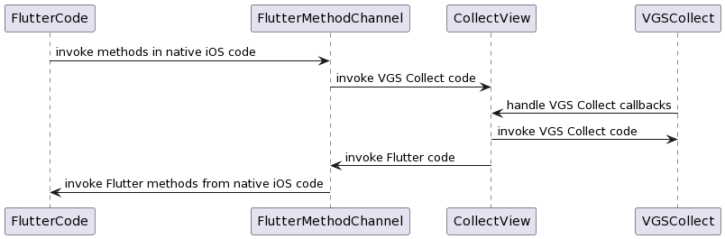
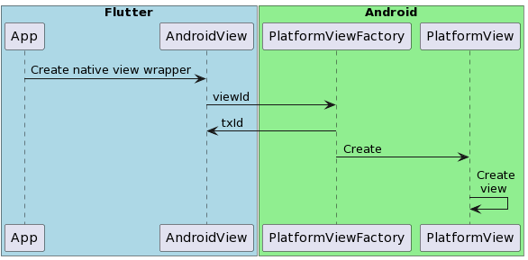
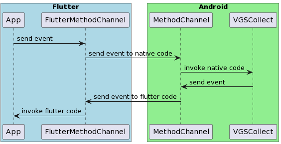

# README

This demo shows how to integrate VGS Collect [iOS](https://github.com/verygoodsecurity/vgs-collect-ios) and [Android](https://github.com/verygoodsecurity/vgs-collect-android) SDK to your Flutter app.
We don't have official Flutter package. You can easily integrate VGS Collect SDK into your mobile crossplatform Flutter apps.

# Table of contents

<!--ts-->

- [Run application](#run-application)
- [iOS VGSCollect integration guide](#ios-vgscollect-integration-guide)
- [iOS CardIO integration guide](#ios-cardio-integration-guide)
- [iOS VGSShow integration guide](#ios-vgsshow-integration-guide)
- [Android VGSCollect integration guide](#android-integration-guide)

<!--te-->

## Run application

1. Required environment:

### Requirements

- Installed <a href="https://flutter.dev/docs/get-started/install" target="_blank">Flutter</a>
- Setup <a href="https://flutter.dev/docs/get-started/editor?tab=androidstudio" target="_blank">IDEA</a>
- Setup <a href="https://flutter.dev/docs/get-started/install/macos#install-xcode" target="_blank">Xcode</a>
- Install <a href="https://cocoapods.org/" target="_blank">Cocoapods</a> for running iOS
- Create your Organization with <a href="https://www.verygoodsecurity.com/">VGS</a>

> **_NOTE:_** Please visit Flutter <a href="https://flutter.dev/docs" target="_blank">documentation</a>
> for more detailed explanation how to setup Flutter and IDEA.</br>
> This sample is compatitable with Flutter 3.2.0 version.</br>
> Check Flutter issues <a href="https://github.com/flutter/flutter/issues" target="_blank">here.</a>

2. Install Flutter packages

```bash
flutter pub get
```

3. `cd` to `ios` folder and run

```bash
  pod install
```

4. `cd` to `lib/utils`. Find `constants.dart` file and set your `vault_id` and `environment`

```dart
class CollectShowConstants {
  static const vaultID = 'vault_id';
  static const environment = 'sandbox';
}
```

5. Run flutter app:\
   On iOS Simulator (<a href="https://flutter.dev/docs/get-started/install/macos#set-up-the-ios-simulator" target="_blank">Run iOS app Flutter docs</a>).\
   On Android Simulator (<a href="https://docs.flutter.dev/get-started/install/macos#set-up-the-android-emulator" target="_blank">Run Android app Flutter docs</a>).

6. In case of possible issues a common fix is to clean project and reinstall packages:

```bash
  flutter clean
  flutter pub get
```

7. In case of error in VS Code `Flutter VsCode error: You don't have an extension for debugging YAML` please check [this answer:](https://stackoverflow.com/a/68949816)

Click on "open a file", then navigate to the main.dart file and then click debug and run.

<p align="center">
	
</p>

## iOS VGSCollect integration guide

General integration overview:

VGS Collect Integration to Flutter project can be separated into two parts.

<b>Implementing PlatformView wrappers for native iOS views:</b>

<p align="center">
	
</p>

<b>Implementing FlutterMethodChannel for communication with Dart code:</b>

<p align="center">
    
</p>

1. Review official Flutter [documentation](https://docs.flutter.dev/development/platform-integration/platform-channels) how to integrate native and Flutter code.

2. Install `VGS Collect SDK` via `CocoaPods`. If you have created from scratch Flutter project usually you need to preinstall `CocoaPods`. `cd` to `ios` folder and run:

```bash
  pod init
```

3. You should have `Podfile` in your `ios` directory. `Podfile` in iOS acts as a `pubspec.yaml` in Flutter and contains list of external dependencies. Add `VGSCollectSDK` pod to `Runner` `target`.

```ruby
target 'Runner' do
  # Comment the next line if you don't want to use dynamic frameworks
  use_frameworks!

  # Pods for Runner

  pod 'VGSCollectSDK'
end
```

4. Make sure deployment minimal iOS version of your target and project is set to `iOS 10` or later in iOS [project settings](https://stackoverflow.com/a/61335546).
   Run:

```bash
  pod update
```

5. Implement native iOS `UIView` subclass which holds `VGSTextFields`.

```swift
//
//  CustomCardDataCollectView.swift
//  Runner
//

import Foundation
import UIKit
import VGSCollectSDK

/// Holds UI for custom card data collect view case.
class CustomCardDataCollectView: UIView {

  // MARK: - Vars

  /// Stack view.
  private lazy var stackView: UIStackView = {
    let stackView = UIStackView()
    stackView.translatesAutoresizingMaskIntoConstraints = false
    stackView.axis = .vertical

    stackView.layoutMargins = UIEdgeInsets(top: 8, left: 16, bottom: 8, right: 16)
    stackView.distribution = .fill
    stackView.spacing = 16
    return stackView
  }()

  /// Card holder text field.
  lazy var cardHolderField: VGSTextField = {
    let field = VGSTextField()
    field.autocapitalizationType = .words
    field.translatesAutoresizingMaskIntoConstraints = false
    field.placeholder = "Cardholder name"
    field.font = UIFont.systemFont(ofSize: 15)
    field.padding = UIEdgeInsets(top: 8, left: 8, bottom: 8, right: 8)

    return field
  }()

  /// Card number text field.
  lazy var cardNumberField: VGSCardTextField = {
    let field = VGSCardTextField()
    field.translatesAutoresizingMaskIntoConstraints = false
    field.placeholder = "Card number"
    field.font = UIFont.systemFont(ofSize: 15)
    field.padding = UIEdgeInsets(top: 8, left: 8, bottom: 8, right: 8)

    return field
  }()

  /// Exp date text field.
  lazy var expDateField: VGSExpDateTextField = {
    let field = VGSExpDateTextField()
    field.translatesAutoresizingMaskIntoConstraints = false
    field.padding = UIEdgeInsets(top: 8, left: 8, bottom: 8, right: 8)

    field.font = UIFont.systemFont(ofSize: 15)
    // Update validation rules

    field.placeholder = "MM/YYYY"
    field.monthPickerFormat = .longSymbols

    return field
  }()

  /// CVC text field.
  lazy var cvcTextField: VGSCVCTextField = {
    let field = VGSCVCTextField()
    field.translatesAutoresizingMaskIntoConstraints = false
    field.padding = UIEdgeInsets(top: 8, left: 8, bottom: 8, right: 8)

    field.font = UIFont.systemFont(ofSize: 15)
    // Update validation rules

    field.placeholder = "CVC/CVV"

    return field
  }()

  // MARK: - Initialization

  // no:doc
  override init(frame: CGRect) {
    super.init(frame: frame)

    addSubview(stackView)
    stackView.pinToSuperviewEdges()
    stackView.addArrangedSubview(cardHolderField)
    stackView.addArrangedSubview(cardNumberField)
    stackView.addArrangedSubview(expDateField)
    stackView.addArrangedSubview(cvcTextField)

    cardNumberField.heightAnchor.constraint(equalToConstant: 60).isActive = true
    expDateField.heightAnchor.constraint(equalToConstant: 60).isActive = true
    cardHolderField.heightAnchor.constraint(equalToConstant: 60).isActive = true
    cvcTextField.heightAnchor.constraint(equalToConstant: 60).isActive = true

  }

  // no:doc
  required init?(coder: NSCoder) {
    fatalError("init(coder:) has not been implemented")
  }
}

```

6. Implement method in iOS `UIView` subclass to bind `VGSTextFields` with `VGSCollect` instance.
   You should specify `fieldNames` matching your route configuration.

```swift
//
//  CustomCardDataCollectView.swift
//  Runner
//

import Foundation
import UIKit
import VGSCollectSDK

/// Holds UI for custom card data collect view case.
class CustomCardDataCollectView: UIView {

   // View setup code..

  // MARK: - Public

  /// Configure fields with VGS Collect instance.
  /// - Parameter vgsCollect: `VGSCollect` object, VGS Collect instance.
  func configureFieldsWithCollect(_ vgsCollect: VGSCollect) {
    let cardConfiguration = VGSConfiguration(collector: vgsCollect, fieldName: "cardNumber")
    cardConfiguration.type = .cardNumber
    cardNumberField.configuration = cardConfiguration

    let expDateConfiguration = VGSExpDateConfiguration(collector: vgsCollect, fieldName: "expDate")
    expDateConfiguration.isRequiredValidOnly = true
    expDateConfiguration.type = .expDate
    expDateConfiguration.inputSource = .keyboard

    // Default .expDate format is "##/##"
    expDateConfiguration.formatPattern = "##/####"
    expDateConfiguration.validationRules = VGSValidationRuleSet(rules: [
      VGSValidationRuleCardExpirationDate(dateFormat: .longYear, error: VGSValidationErrorType.expDate.rawValue)
    ])

    let cvcConfiguration = VGSConfiguration(collector: vgsCollect, fieldName: "card_cvc")
    cvcConfiguration.isRequired = true
    cvcConfiguration.type = .cvc

    cvcTextField.configuration = cvcConfiguration
    cvcTextField.isSecureTextEntry = true

    let holderConfiguration = VGSConfiguration(collector: vgsCollect, fieldName: "cardHolder_name")
    holderConfiguration.type = .cardHolderName
    holderConfiguration.keyboardType = .namePhonePad

    cardHolderField.textAlignment = .natural
    cardHolderField.configuration = holderConfiguration

    expDateField.configuration = expDateConfiguration
  }
}
```

7. Implement `FlutterPlatformView` subclass which holds `CustomCardDataCollectView`. `FlutterCustomCardDataCollectView` should aslo have `FlutterMethodChannel` instance to communicate with Flutter code.

```swift
import Foundation
import Flutter
import UIKit
import VGSCollectSDK

/// FlutterPlatformView wrapper for Collect view.
class FlutterCustomCardDataCollectView: NSObject, FlutterPlatformView {

  // MARK: - Vars

  /// VGS Collect instance.
  var vgsCollect: VGSCollect?

  /// Collect view.
  let collectView: CustomCardDataCollectView

  /// Flutter binary messenger.
  let messenger: FlutterBinaryMessenger

  /// Flutter method channel.
  let channel: FlutterMethodChannel

  /// View id.
  let viewId: Int64

  // MARK: - Initialization.

  /// Initializatier.
  /// - Parameters:
  ///   - messenger: `FlutterBinaryMessenger` object, Flutter binary messenger.
  ///   - frame: `CGRect` object, view frame.
  ///   - viewId: `Int64` object, view unique id.
  ///   - args: `Any?` object, arguments.
  init(messenger: FlutterBinaryMessenger,
       frame: CGRect,
       viewId: Int64,
       args: Any?) {
    self.messenger = messenger
    self.viewId = viewId
    self.collectView = CustomCardDataCollectView()

    // Create flutter method channel.
    self.channel = FlutterMethodChannel(name: "card-collect-form-view/\(viewId)",
                                        binaryMessenger: messenger)

    super.init()
  }

  // MARK: - Event channel

  // MARK: - FlutterPlatformView

  // no:doc
  public func view() -> UIView {
    return collectView
  }

  // MARK: - Helpers

  /// Configure VGS Collect.
  /// - Parameter args: `Any?` object, method arguments.
  private func configCollect(with args: Any?) {
    guard let payload = args as? [String:Any],
          let vaultID = payload["vault_id"] as? String,
          let environment = payload["environment"] as? String else {
      assertionFailure("Invalid config")
      return
    }

    let vgsCollect = VGSCollect(id: vaultID, environment: environment)
    self.collectView.configureFieldsWithCollect(vgsCollect)
    self.vgsCollect = vgsCollect

    // Observing text fields. The call back return all textfields with updated states. You also can you VGSTextFieldDelegate
    vgsCollect.observeStates = { [weak self] form in

      var newText = ""

      form.forEach({ textField in
        newText.append(textField.state.description)
        newText.append("\n")
      })
      var payload = [String: Any]()
      payload["STATE_DESCRIPTION"] = newText
      self?.channel.invokeMethod("stateDidChange", arguments: payload)
      //FlutterCollectChannel.shared.eventSink?(payload)
    }
  }

  /// Validate form with Flutter result complection block.
  /// - Parameter result: `FlutterResult` object, flutter results.
  private func validateForm(with result: @escaping FlutterResult) {
    let invalidFields = vgsCollect!.textFields.compactMap{$0.state.isValid}.filter({$0 == false})
    result(invalidFields.isEmpty)
  }

  /// Redact card with Flutter result completion block object.
  /// - Parameter result: `FlutterResult` object, Flutter result completion block object.
  private func redactCard(with result: @escaping FlutterResult)  {
    vgsCollect?.sendData(path: "/post", extraData: nil) {[weak self](response) in
      switch response {
      case .success(_, let data, _):
        if let data = data, let jsonData = try? JSONSerialization.jsonObject(with: data, options: []) as? [String: Any] {

          print("SUCCESS: \(jsonData)")
          let payload: [String: Any] = [
            "STATUS": "SUCCESS",
            "DATA": jsonData
          ]
          result(payload)
        }
        return
      case .failure(let code, _, _, let error):
        var errorInfo: [String : Any] = [:]
        errorInfo["collect_error_code"] = code

        if let message = error?.localizedDescription {
          errorInfo["collect_error_message"] = message
        }
        switch code {
        case 400..<499:
          // Wrong request. This also can happend when your Routs not setup yet or your <vaultId> is wrong
          print("Error: Wrong Request, code: \(code)")
        case VGSErrorType.inputDataIsNotValid.rawValue:
          if let error = error as? VGSError {
            print("Error: Input data is not valid. Details:\n \(error)")
          }
        default:
          print("Error: Something went wrong. Code: \(code)")
        }
        print("Submit request error: \(code), \(String(describing: error))")

        let payload: [String: Any]  = [
          "STATUS": "FAILED",
        ]
        result(payload)
        return
      }
    }
  }
}
```

8.  Implement method channels and handlers to invoke native iOS code
    from Flutter by sending messages.
    The Method Channel stems from binary messaging and the platform channel and supports a bidirectional invocation of methods.

```swift
// Handle methods from Flutter.
channel.setMethodCallHandler({[weak self] (call: FlutterMethodCall, result: @escaping FlutterResult) -> Void in
      switch call.method {
      case "configureCollect":
        self?.configCollect(with: call.arguments)
        result(nil)
      case "redactCard":
        self?.redactCard(with: result)
      case "isFormValid":
        self?.validateForm(with: result)
      case "showKeyboard":
        self?.collectView.cardHolderField.becomeFirstResponder()
        result(nil)
      case "hideKeyboard":
        self?.collectView.endEditing(true)
        result(nil)
      default:
        result(FlutterMethodNotImplemented)
      }
})

```

> **_NOTE:_** it is important to call `FlutterResult` callback in `iOS` code. In this way you can notify `Flutter` app that `VGSCollect` started `async` operation and you can `await` for its completion.

9. Implement class which confirms to `FlutterPlatformViewFactory` interface.

```swift
import Foundation
import Flutter
import UIKit
import VGSCollectSDK

/// Flutter platform view factory.
class FlutterCustomCardDataCollectViewFactory: NSObject, FlutterPlatformViewFactory {

  // MARK: - Private vars

  /// Flutter binary messenger.
  private var messenger: FlutterBinaryMessenger

  // MARK: - Initialization

  /// Initializer.
  /// - Parameter messenger: `FlutterBinaryMessenger` object, Flutter binary messenger.
  init(messenger: FlutterBinaryMessenger) {
    self.messenger = messenger
  }

  // MARK: - FlutterPlatformViewFactory

  // no:doc
  public func create(withFrame frame: CGRect,
                     viewIdentifier viewId: Int64,
                     arguments args: Any?) -> FlutterPlatformView {
    return FlutterCustomCardDataCollectView(messenger: messenger,
                                            frame: frame, viewId: viewId,
                                            args: args)
  }

  // no:doc
  public func createArgsCodec() -> FlutterMessageCodec & NSObjectProtocol {
    return FlutterStandardMessageCodec.sharedInstance()
  }
}


```

10. Implement CollectView Flutter Plugin.

```swift
import Foundation
import Flutter

/// Flutter plugin for bridging VGSCollect.
public class FlutterCustomCardDataCollectViewPlugin {

  /// View factory.
  static var viewFactory: FlutterCustomCardDataCollectViewFactory?

  /// Registers Flutter plugin.
  /// - Parameter registrar: `FlutterPluginRegistrar` object, Flutter plugin registrar.
  class func register(with registrar: FlutterPluginRegistrar) {
    viewFactory = FlutterCustomCardDataCollectViewFactory(messenger: registrar.messenger())

    registrar.register(viewFactory!, withId: "card-collect-form-view")
  }
}
```

11. Register Flutter plugin in AppDelegate. AppDelegate acts as an entry point of native iOS application.

```swift
import UIKit
import Flutter

@UIApplicationMain
@objc class AppDelegate: FlutterAppDelegate {
  override func application(
    _ application: UIApplication,
    didFinishLaunchingWithOptions launchOptions: [UIApplication.LaunchOptionsKey: Any]?
  ) -> Bool {

    GeneratedPluginRegistrant.register(with: self)
    FlutterCustomCardDataCollectViewPlugin.register(with: registrar(forPlugin: "FlutterCustomCardDataCollectPlugin")!)

    return super.application(application, didFinishLaunchingWithOptions: launchOptions)
  }
}
```

12. Create `UIKitView` in your Flutter project to instantiate native iOS view as a Flutter `Widget`.

```dart
Widget _cardCollectNativeiOS() {
    final Map<String, dynamic> creationParams = <String, dynamic>{};
    return Column(children: [
      SizedBox(
          height: 290.0,
          child: UiKitView(
              viewType: customCardDataCollectViewType,
              onPlatformViewCreated: _createCardCollectController,
              creationParams: creationParams,
              creationParamsCodec: StandardMessageCodec()))
    ]);
 }

```

13. On Platform view creation instantiate `CustomCardDataController` object that will be used to communicate with native iOS code though the Flutter Method Channel.

```dart
void _createCardCollectController(int id) {
    _collectController = CustomCardDataController(id);
    _collectController.channel.setMethodCallHandler(invokedMethods);
}
```

Define constants for method names:

```dart
class MethodNames {
  static const String configureCollect = 'configureCollect';
  static const String configureShow = 'configureShow';
  static const String redactCard = 'redactCard';
  static const String revealCard = 'revealCard';
  static const String copyCard = 'copyCard';
  static const String isFormValid = 'isFormValid';
  static const String presentCardIO = 'presentCardIO';
  static const String showKeyboard = 'showKeyboard';
  static const String hideKeyboard = 'hideKeyboard';
  static const String stateDidChange = 'stateDidChange';
  static const String userDidCancelScan = 'userDidCancelScan';
  static const String userDidFinishScan = 'userDidFinishScan';
}

```

`CustomCardDataController` should hold methods to invoke.

```dart
import 'package:flutter/services.dart';

const customCardDataCollectViewType = 'card-collect-form-view';

class CustomCardDataController {
  CustomCardDataController(int id)
      : channel = MethodChannel('$customCardDataCollectViewType/$id');

  final MethodChannel channel;

  Future<void> configureCollect() async {
    return await channel.invokeMethod(MethodNames.configureCollect, {
      'vault_id': CollectShowConstants.vaultID,
      'environment': CollectShowConstants.environment
    });
  }

  Future<bool> validateForm() async {
    return await channel.invokeMethod(MethodNames.isFormValid);
  }

  Future<void> presentCardIO() async {
    return await channel.invokeMethod(MethodNames.presentCardIO);
  }

  Future<void> showKeyboard() async {
    return await channel.invokeMethod(MethodNames.showKeyboard);
  }

  Future<void> hideKeyboard() async {
    return await channel.invokeMethod(MethodNames.hideKeyboard);
  }

  Future<Map<dynamic, dynamic>> sendData() async {
    return await channel.invokeMethod(MethodNames.redactCard);
  }
}

```

14. Add method handlers called from Native code in your Flutter implementation.

```dart
Future<dynamic> invokedMethods(MethodCall methodCall) async {
    var textToDisplay = '';
    final arguments = methodCall.arguments;
    switch (methodCall.method) {
      case MethodNames.stateDidChange:
        if (arguments != null && arguments is Map<dynamic, dynamic>) {
          var eventData = new Map<String, dynamic>.from(arguments);
          final description = eventData['STATE_DESCRIPTION'] as String;
          textToDisplay = description;
        }
        break;
      default:
        break;
    }

    setState(() {
      _outputText = textToDisplay;
    });
 }

```

15. Show/hide keyboard:

```swift
// Handle methods from Flutter.
channel.setMethodCallHandler({[weak self] (call: FlutterMethodCall, result: @escaping FlutterResult) -> Void in
      switch call.method {
      case "showKeyboard":
        self?.collectView.cardHolderField.becomeFirstResponder()
        result(nil)
      case "hideKeyboard":
        self?.collectView.endEditing(true)
        result(nil)
      default:
        result(FlutterMethodNotImplemented)
      }
})
```

```dart
Future<void> showKeyboard() async {
  return await channel.invokeMethod(MethodNames.showKeyboard);
}

Future<void> hideKeyboard() async {
  return await channel.invokeMethod(MethodNames.hideKeyboard);
}
```

## iOS CardIO integration guide

You can integrate `CardIO` scanner with `VGSCollect` as PCI Compliant card scanner solution.

1. Add `VGSCollectSDK/CardIO` pod to `Podfile`.

```ruby
target 'Runner' do
  # Comment the next line if you don't want to use dynamic frameworks
  use_frameworks!

  # Pods for Runner

  pod 'VGSCollectSDK'

  # Add CardIO module to use Card.io as scan provider
  pod 'VGSCollectSDK/CardIO'
end
```

2. Include `NSCameraUsageDescription` key in iOS project `info.plist` to enable Camera in your iOS application.

```xml
    <key>NSCameraUsageDescription</key>
    <string>Camera usage description</string>
```

3. Create `VGSCardIOScanController` object in `FlutterCustomCardDataCollectView`.

```swift
import Foundation
import Flutter
import UIKit
import VGSCollectSDK

/// FlutterPlatformView wrapper for Collect view.
class FlutterCustomCardDataCollectView: NSObject, FlutterPlatformView {

  // MARK: - Vars

  /// VGS Collect instance.
  var vgsCollect: VGSCollect?

  /// Collect view.
  let collectView: CustomCardDataCollectView

  /// Flutter binary messenger.
  let messenger: FlutterBinaryMessenger

  /// Flutter method channel.
  let channel: FlutterMethodChannel

  /// View id.
  let viewId: Int64

  /// CardIO controller.
  let cardIOController: VGSCardIOScanController

  // MARK: - Initialization.

  /// Initializatier.
  /// - Parameters:
  ///   - messenger: `FlutterBinaryMessenger` object, Flutter binary messenger.
  ///   - frame: `CGRect` object, view frame.
  ///   - viewId: `Int64` object, view unique id.
  ///   - args: `Any?` object, arguments.
  init(messenger: FlutterBinaryMessenger,
       frame: CGRect,
       viewId: Int64,
       args: Any?) {
    self.messenger = messenger
    self.viewId = viewId
    self.collectView = CustomCardDataCollectView()

    // Create flutter method channel.
    self.channel = FlutterMethodChannel(name: "card-collect-form-view/\(viewId)",
                                        binaryMessenger: messenger)
    self.cardIOController = VGSCardIOScanController()

    super.init()
    self.cardIOController.delegate = self

    // Handle methods from Flutter.
    channel.setMethodCallHandler({[weak self] (call: FlutterMethodCall, result: @escaping FlutterResult) -> Void in
      switch call.method {
      case "presentCardIO":
        let vc = UIApplication.shared.windows.first!.rootViewController!
        self?.cardIOController.presentCardScanner(on: vc, animated: true, modalPresentationStyle: .fullScreen, completion: nil)
      default:
        result(FlutterMethodNotImplemented)
      }
    })
  }
}
```

4. Implement `VGSCardIOScanControllerDelegate` interface for `FlutterCustomCardDataCollectView`.
   A delegate is just a class that does some work for another class and instances are usually linked by weak reference. It is important to implement `VGSCardIOScanControllerDelegate` so `CardIO` can set scanned data into `VGSTextFields`.
   You need to listen to `VGSCardIOScanControllerDelegate` methods and invoke methods in Flutter code using `invokeMethod` in Flutter method channel.

```swift
// MARK: - VGSCardIOScanControllerDelegate

// no:doc
extension FlutterCustomCardDataCollectView: VGSCardIOScanControllerDelegate {

  // no:doc
  func userDidFinishScan() {
    self.cardIOController.dismissCardScanner(animated: true, completion: {
      self.channel.invokeMethod("userDidFinishScan", arguments: nil)
    })
  }

  // no:doc
  func userDidCancelScan() {
    self.cardIOController.dismissCardScanner(animated: true, completion: {
      self.channel.invokeMethod("userDidCancelScan", arguments: nil)
    })
  }

  // no:doc
  func textFieldForScannedData(type: CradIODataType) -> VGSTextField? {
    switch type {
    case .cardNumber:
      return collectView.cardNumberField
    case .expirationDateLong:
      return collectView.expDateField
    case .cvc:
      return collectView.cvcTextField
    default:
      return nil
    }
  }
}

```

5. Present `CardIO` screen and handle `CardIO` callbacks using Flutter method Channel. `CardIO` will be presented as a separate full screen Widget. You cannot add your own widgets on `CardIO` screen.

```dart
await _collectController.presentCardIO();
```

6. VGS `CardIO` cannot post events directly to Dart code. You can handle `CardIO` delegate methods in Native iOS code and republish events to Dart Code using Flutter method channel for handling `cancel/finish` user actions.

```dart
Future<dynamic> invokedMethods(MethodCall methodCall) async {
    var textToDisplay = '';
    final arguments = methodCall.arguments;
    switch (methodCall.method) {
      case MethodNames.userDidCancelScan:
        textToDisplay = 'User did cancel scan';
        SnackBarUtils.showSnackBar(
          context,
          text: textToDisplay,
        );
        break;
      case MethodNames.userDidFinishScan:
        textToDisplay = 'User did finish scan';
        SnackBarUtils.showSnackBar(
          context,
          text: textToDisplay,
          color: Colors.lightGreen,
        );
        break;
      default:
        break;
    }

    setState(() {
      _outputText = textToDisplay;
    });
  }
```

## iOS VGSShow integration guide

Check [VGSShow use case](https://github.com/EugeneIOs/test-flutter-app/tree/main/lib/presentation/pages/collect_show) section for VGSShow integration guide.

## Android integration guide

Integration to Flutter project can be separated into two parts.

<b>Implementing PlatformView wrappers for native Android views:</b>

<p align="center">
	
</p>

<b>Implementing MethodChannel for communication between dart and native code:</b>

<p align="center">
    
</p>

1. Add dependencies into your `android/app/build.gradle`:

```groovy
dependencies {

    implementation 'com.verygoodsecurity:vgscollect:latest_version'
    implementation 'com.verygoodsecurity:vgsshow:latest_version'
    implementation 'com.verygoodsecurity:adapter-cardio:latest_version'
}
```

2. Review official
   Flutter [documentation](https://docs.flutter.dev/development/platform-integration/platform-channels)
   how to integrate native and Flutter code.

3. Check our [implementation](https://github.com/EugeneIOs/test-flutter-app/tree/main/android/app/src/main/kotlin/com/example/vgs_collect_flutter_demo).

| Package      | Description                                                  |
|--------------|--------------------------------------------------------------|
| com.example.vgs_collect_flutter_demo | Root package.                                                |
| com.example.vgs_collect_flutter_demo.view | All platform views and factories.                            |
| com.example.vgs_collect_flutter_demo.view.collect | Platform view and factory used in custom example.            |
| com.example.vgs_collect_flutter_demo.view.collect_show | Platform views and factories used in collect & show example. |
