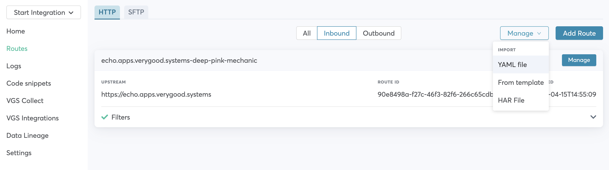

# README

This demo shows how to integrate VGS Show [iOS](https://github.com/verygoodsecurity/vgs-show-ios) and [Android](https://github.com/verygoodsecurity/vgs-show-android) SDK to your Flutter app.
We don't have official Flutter package. You can easily integrate VGS Show SDK into your mobile crossplatform Flutter apps.

# Table of contents

<!--ts-->

- [Run application](#run-application)
- [iOS VGSShow integration guide](#ios-vgsshow-integration-guide)
- [Android VGSShow integration guide](#android-vgsshow-integration-guide)
<!--te-->

## Run application

1. Required environment:

### Requirements

- Installed <a href="https://flutter.dev/docs/get-started/install" target="_blank">Flutter</a>
- Setup <a href="https://flutter.dev/docs/get-started/editor?tab=androidstudio" target="_blank">IDEA</a>
- Setup <a href="https://flutter.dev/docs/get-started/install/macos#install-xcode" target="_blank">Xcode</a>
- Install <a href="https://cocoapods.org/" target="_blank">Cocoapods</a> for running iOS
- Create your Organization with <a href="https://www.verygoodsecurity.com/">VGS</a>

> **_NOTE:_** Please visit Flutter <a href="https://flutter.dev/docs" target="_blank">documentation</a>
> for more detailed explanation how to setup Flutter and IDEA.</br>
> This sample is compatitable with Flutter 3.2.0 version.</br>
> Check Flutter issues <a href="https://github.com/flutter/flutter/issues" target="_blank">here.</a>

2. Setup routes.

Go to your <a href="https://dashboard.verygoodsecurity.com/" target="_blank">VGS organization</a> and establish <a href="https://www.verygoodsecurity.com/docs/getting-started/quick-integration#securing-inbound-connection" target="_blank">Inbound connection</a>. For this demo you can import pre-built route configuration:

<p align="center">

</p>

- Find the **configuration.yaml** file inside the app repository and download it.
- Go to the **Routes** section on the <a href="https://dashboard.verygoodsecurity.com/" target="_blank">Dashboard</a> page and select the **Inbound** tab.
- Press **Manage** button at the right corner and select **Import YAML file**.
- Choose **configuration.yaml** file that you just downloaded and tap on **Save** button to save the route.

3. Install Flutter packages

```bash
flutter pub get
```

4. `cd` to `ios` folder and run

```bash
  pod install
```

5. `cd` to `lib/utils`. Find `constants.dart` file and set your `vault_id` and `environment`

```dart
class CollectShowConstants {
  static const vaultID = 'vault_id';
  static const environment = 'sandbox';
  static const revealPath = 'post';
}
```

6. Run flutter app:\
   On iOS Simulator (<a href="https://flutter.dev/docs/get-started/install/macos#set-up-the-ios-simulator" target="_blank">Run iOS app Flutter docs</a>).\
   On Android Simulator (<a href="https://docs.flutter.dev/get-started/install/macos#set-up-the-android-emulator" target="_blank">Run Android app Flutter docs</a>).

7. Open tab `Reveal card data with VGSShow`

8. In case of possible issues a common fix is to clean project and reinstall packages:

```bash
  flutter clean
  flutter pub get
```

9. In case of error in VS Code `Flutter VsCode error: You don't have an extension for debugging YAML` please check [this answer:](https://stackoverflow.com/a/68949816)

Click on "open a file", then navigate to the main.dart file and then click debug and run.

<p align="center">
	
</p>

## iOS integration guide

General integration overview:

VGS Show Integration to Flutter project can be separated into two parts.

<b>Implementing PlatformView wrappers for native iOS views:</b>

<p align="center">
	
</p>

<b>Implementing FlutterMethodChannel for communication with Dart code:</b>

<p align="center">
    
</p>

## iOS VGSShow integration guide

1. Review official Flutter [documentation](https://docs.flutter.dev/development/platform-integration/platform-channels) how to integrate native and Flutter code.

2. Install `VGSShowSDK` via `CocoaPods`. If you have created from scratch Flutter project usually you need to preinstall `CocoaPods`. `cd` to `ios` folder and run:

```bash
  pod init
```

3. You should have `Podfile` in your `ios` directory. `Podfile` in iOS acts as a `pubspec.yaml` in Flutter and contains list of external dependencies. Add `VGSShowSDK` pod to `Runner` `target`.

```ruby
target 'Runner' do
  # Comment the next line if you don't want to use dynamic frameworks
  use_frameworks!

  # Pods for Runner

  pod 'VGSShowSDK'
end
```

4. Make sure deployment minimal iOS version of your target and project is set to `iOS 10` or later in iOS [project settings](https://stackoverflow.com/a/61335546).
   Run:

```bash
  pod update
```

5. Implement native iOS `UIView` subclass which holds `VGSLabels`.
   `VGSLabel` contentPath should match your route configuration.
   Add method for subscribing `VGSLabels` to `VGSShow` instance.

```swift
import Foundation
import UIKit
import VGSShowSDK

/// Native UIView subclass, holds VGSLabels.
class ShowCardView: UIView {

  // MARK: - Vars
  private lazy var stackView: UIStackView = {
    let stackView = UIStackView()
    stackView.translatesAutoresizingMaskIntoConstraints = false
    stackView.axis = .vertical

    stackView.layoutMargins = UIEdgeInsets(top: 8, left: 16, bottom: 8, right: 16)
    stackView.distribution = .fill
    stackView.spacing = 16
    return stackView
  }()

  /// Cardholder label.
  private lazy var cardHolderLabel: VGSLabel = {
    let label = ShowCardView.provideStylesVGSLabel()

    label.placeholder = "Card holder"
    label.contentPath = "json.payment_card_holder_name"

    return label
  }()

  /// Card number label.
  lazy var cardNumberVGSLabel: VGSLabel = {
    let label = ShowCardView.provideStylesVGSLabel()

    label.placeholder = "Card number"
    label.contentPath = "json.payment_card_number"

    // Create regex object, split card number to XXXX XXXX XXXX XXXX format.
    do {
      let cardNumberPattern = "(\\d{4})(\\d{4})(\\d{4})(\\d{4})"
      let template = "$1 $2 $3 $4"
      let regex = try NSRegularExpression(pattern: cardNumberPattern, options: [])

      // Add transformation regex to your label.
      label.addTransformationRegex(regex, template: template)
    } catch {
      assertionFailure("invalid regex, error: \(error)")
    }

    return label
  }()

  /// Exp date label.
  private lazy var expirationDateLabel: VGSLabel = {
    let label = ShowCardView.provideStylesVGSLabel()

    label.placeholder = "Expiration date"
    label.contentPath = "json.payment_card_expiration_date"

    return label
  }()

  // MARK: - Initialization

  // no:doc
  override init(frame: CGRect) {
    super.init(frame: frame)

    addSubview(stackView)
    stackView.pinToSuperviewEdges()
    stackView.addArrangedSubview(cardHolderLabel)
    stackView.addArrangedSubview(cardNumberVGSLabel)
    stackView.addArrangedSubview(expirationDateLabel)

    cardHolderLabel.heightAnchor.constraint(equalToConstant: 60).isActive = true
    cardNumberVGSLabel.heightAnchor.constraint(equalToConstant: 60).isActive = true
    expirationDateLabel.heightAnchor.constraint(equalToConstant: 60).isActive = true
  }

  // no:doc
  required init?(coder: NSCoder) {
    fatalError("init(coder:) has not been implemented")
  }

  // MARK: - Public

  /// Subscribe views to vgsShow.
  /// - Parameter vgsShow: `VGSShow` object, vgs show instance.
  func subscribeViewsToShow(_ vgsShow: VGSShow) {
    vgsShow.subscribe(cardHolderLabel)
    vgsShow.subscribe(cardNumberVGSLabel)
    vgsShow.subscribe(expirationDateLabel)
  }

  // MARK: - Private

  /// Provides `VGSLabel`.
  /// - Returns: `VGSLabel` object, VGSLabel instance.
  static private func provideStylesVGSLabel() -> VGSLabel {
    let label = VGSLabel()
    label.translatesAutoresizingMaskIntoConstraints = false
    label.font = UIFont.systemFont(ofSize: 14)
    label.placeholderStyle.color = .black
    label.placeholderStyle.textAlignment = .center
    label.textAlignment = .center

    return label
  }
}

```

6. Implement `FlutterShowCardView` subclass which holds `ShowCardView`. `FlutterShowCardView` should aslo have `FlutterMethodChannel` instance to communicate with Flutter code.

```swift
import Flutter
import UIKit
import VGSCollectSDK
import VGSShowSDK

/// FlutterPlatformView wrapper for Show view.
class FlutterShowCardView: NSObject, FlutterPlatformView {

  // MARK: - Vars

  /// VGS Show instance.
  var vgsShow: VGSShow?

  /// Show view.
  let showCardView: ShowCardView

  /// Flutter binary messenger.
  let messenger: FlutterBinaryMessenger

  /// Flutter method channel.
  let channel: FlutterMethodChannel

  /// View id.
  let viewId: Int64

  // MARK: - Initialization.

  /// Initializatier.
  /// - Parameters:
  ///   - messenger: `FlutterBinaryMessenger` object, Flutter binary messenger.
  ///   - frame: `CGRect` object, view frame.
  ///   - viewId: `Int64` object, view unique id.
  ///   - args: `Any?` object, arguments.
  init(messenger: FlutterBinaryMessenger,
       frame: CGRect,
       viewId: Int64,
       args: Any?) {
    self.messenger = messenger
    self.viewId = viewId
    self.showCardView = ShowCardView()

    // Create flutter method channel.
    self.channel = FlutterMethodChannel(name: "show-card-form-view/\(viewId)",
                                       binaryMessenger: messenger)


    super.init()

    // Handle methods from Flutter.
    channel.setMethodCallHandler({[weak self] (call: FlutterMethodCall, result: @escaping FlutterResult) -> Void in
      switch call.method {
      case "configureShow":
        self?.configShow(with: call.arguments)
        result(nil)
      case "copyCard":
        self?.showCardView.cardNumberVGSLabel.copyTextToClipboard()
        result(nil)
      case "revealCard":
        self?.revealCard(with: call.arguments, result: result)
      default:
        result(FlutterMethodNotImplemented)
      }
    })
  }

  // MARK: - Event channel

  // MARK: - FlutterPlatformView

  // no:doc
  public func view() -> UIView {
   return showCardView
  }

  // MARK: - Helpers

  /// Configure VGS Show.
  /// - Parameter args: `Any?` object, method arguments.
  private func configShow(with args: Any?) {
    guard let payload = args as? [String: Any],
          let vaultID = payload["vault_id"] as? String,
       let environment = payload["environment"] as? String else {
      assertionFailure("Invalid config")
      return
    }

    let vgsShow = VGSShow(id: vaultID, environment: environment)
    self.showCardView.subscribeViewsToShow(vgsShow)
    self.vgsShow = vgsShow
  }

  /// Redact card with Flutter result completion block object.
  /// - Parameter result: `FlutterResult` object, Flutter result completion block object.
  private func revealCard(with args: Any?, result: @escaping FlutterResult)  {
    guard let payload = args as? [String: Any],
          let path = payload["path"] as? String,
          let payloadToReveal = payload["payload"] as? [String: Any] else {
      assertionFailure("Invalid config")
      return
    }

    vgsShow?.request(path: path, payload: payloadToReveal,  completion: { requestResult in
      switch requestResult {
      case .success(let code):
        let payload: [String: Any]  = [
          "STATUS": "SUCCESS",
        ]
        result(payload)
      case .failure(let code, let error):
        let payload: [String: Any]  = [
          "STATUS": "FAILED",
          "CODE": code
        ]
        result(payload)
      }
    })
  }
}

```

7.  Implement method channels and handlers to invoke native iOS code
    from Flutter by sending messages.
    The Method Channel stems from binary messaging and the platform channel and supports a bidirectional invokation of methods.

```swift
// Handle methods from Flutter.
channel.setMethodCallHandler({[weak self] (call: FlutterMethodCall, result: @escaping FlutterResult) -> Void in
        switch call.method {
        case "configureShow":
            self?.configShow(with: call.arguments)
            result(nil)
        case "copyCard":
            self?.showCardView.cardNumberVGSLabel.copyTextToClipboard()
            result(nil)
        case "revealCard":
            self?.revealCard(with: call.arguments, result: result)
        default:
            result(FlutterMethodNotImplemented)
        }
})

```

> **_NOTE:_** it is important to call `FlutterResult` callback in `iOS` code. In this way you can notify `Flutter` app that `VGSShow` started `async` operation and you can `await` for its completion.

8. Implement class which confirms to `FlutterPlatformViewFactory` interface.

```swift
import Foundation
import Flutter
import UIKit
import VGSCollectSDK

/// Flutter platform view factory.
class FlutterShowPlatformViewFactory: NSObject, FlutterPlatformViewFactory {

  // MARK: - Private vars

  /// Flutter binary messenger.
  private var messenger: FlutterBinaryMessenger

  // MARK: - Initialization

  /// Initializer.
  /// - Parameter messenger: `FlutterBinaryMessenger` object, Flutter binary messenger.
  init(messenger: FlutterBinaryMessenger) {
    self.messenger = messenger
  }

  // MARK: - FlutterPlatformViewFactory

  // no:doc
  public func create(withFrame frame: CGRect,
                     viewIdentifier viewId: Int64,
                     arguments args: Any?) -> FlutterPlatformView {
    return FlutterShowCardView(messenger: messenger,
                              frame: frame, viewId: viewId,
                              args: args)
  }

  // no:doc
  public func createArgsCodec() -> FlutterMessageCodec & NSObjectProtocol {
    return FlutterStandardMessageCodec.sharedInstance()
  }
}

```

9. Implement ShowView Flutter Plugin.

```swift
import Foundation
import Flutter

/// Flutter plugin for bridging VGSShow.
public class FlutterShowViewPlugin {

  /// View factory.
  static var viewFactory: FlutterShowPlatformViewFactory?

  /// Registers Flutter plugin.
  /// - Parameter registrar: `FlutterPluginRegistrar` object, Flutter plugin registrar.
  class func register(with registrar: FlutterPluginRegistrar) {
    viewFactory = FlutterShowPlatformViewFactory(messenger: registrar.messenger())

    registrar.register(viewFactory!, withId: "show-card-form-view")
  }
}

```

10. Register Flutter plugin in AppDelegate. AppDelegate acts as an entry point of native iOS application.

```swift
import UIKit
import Flutter

@UIApplicationMain
@objc class AppDelegate: FlutterAppDelegate {
  override func application(
    _ application: UIApplication,
    didFinishLaunchingWithOptions launchOptions: [UIApplication.LaunchOptionsKey: Any]?
  ) -> Bool {

        FlutterShowViewPlugin.register(with: registrar(forPlugin: "FlutterShowViewPlugin")!)

	return super.application(application, didFinishLaunchingWithOptions: launchOptions)
  }
}
```

11. Create `UIKitView` in your Flutter project to instantiate native iOS view as a Flutter `Widget`.

```dart
Widget _cardShowNativeiOS() {
    final Map<String, dynamic> creationParams = <String, dynamic>{};
    return Column(children: [
      SizedBox(
          height: 215.0,
          child: UiKitView(
              viewType: showCardDataViewType,
              onPlatformViewCreated: _createShowCardController,
              creationParams: creationParams,
              creationParamsCodec: StandardMessageCodec()))
    ]);
}

```

12. On Platform view creation instantiate `ShowCardDataController` object that will be used to communicate with native iOS code though the Flutter Method Channel.

```dart
void _createShowCardController(int id) {
    _showController = ShowCardDataController(id);
    _showController.channel.setMethodCallHandler(invokedMethods);
    _showController.configureShow();
}

```

Define constants for method names:

```dart
class MethodNames {
  static const String configureCollect = 'configureCollect';
  static const String configureShow = 'configureShow';
  static const String redactCard = 'redactCard';
  static const String revealCard = 'revealCard';
  static const String copyCard = 'copyCard';
  static const String isFormValid = 'isFormValid';
  static const String presentCardIO = 'presentCardIO';
  static const String showKeyboard = 'showKeyboard';
  static const String hideKeyboard = 'hideKeyboard';
  static const String stateDidChange = 'stateDidChange';
  static const String userDidCancelScan = 'userDidCancelScan';
  static const String userDidFinishScan = 'userDidFinishScan';
}

```

`ShowCardDataController` should hold methods to invoke.

```dart
import 'package:flutter/services.dart';
import 'package:vgs_collect_flutter_demo/utils/constants.dart';

const showCardDataViewType = 'show-card-form-view';

class ShowCardDataController {
  ShowCardDataController(int id)
      : channel = MethodChannel('$showCardDataViewType/$id');

  final MethodChannel channel;

  Future<void> configureShow() async {
    return await channel.invokeMethod(MethodNames.configureShow, {
      'vault_id': CollectShowConstants.vaultID,
      'environment': CollectShowConstants.environment
    });
  }

  Future<Map<dynamic, dynamic>> revealData(dynamic payload, String path) async {
    return await channel.invokeMethod(
        MethodNames.revealCard, {'payload': payload, 'path': path});
  }

  Future<void> copyCardNumber() async {
    return await channel.invokeMethod(MethodNames.copyCard);
  }
}

```

13. Reveal data in your Flutter code.

```dart
sendData(dynamic payload) async {
    setState(() {
      _isLoading = true;
    });
    final result = await _showController.revealData(
      payload,
      CollectConstants.revealPath,
    );
    var resultData = new Map<String, dynamic>.from(result);
    final resultStatus = resultData[EventPayloadNames.status];
    if (resultStatus == EventPayloadNames.success) {
      setState(() {
        _isLoading = false;
        _isRevealed = true;
      });
      SnackBarUtils.showErrorSnackBar(
        context,
        text: 'SUCCESS!',
        color: Colors.lightGreen,
      );
    } else if (resultStatus == EventPayloadNames.failed) {
      setState(() {
        _isLoading = false;
      });
      SnackBarUtils.showErrorSnackBar(
        context,
        text: 'Failed to reveal data!',
        color: Colors.red,
      );
    }
}

```

14. Implement copy card.

In iOS code implement method handler for `copyCard`:

```swift
channel.setMethodCallHandler({[weak self] (call: FlutterMethodCall, result: @escaping FlutterResult) -> Void in
      switch call.method {
      case "copyCard":
        self?.showCardView.cardNumberVGSLabel.copyTextToClipboard()
        result(nil)
      default:
        result(FlutterMethodNotImplemented)
      }
})

```

In Dart dart code implement `copyCard` method invokation with method channel:

```dart
Future<void> copyCardNumber() async {
    return await channel.invokeMethod(MethodNames.copyCard);
}

```

## Android VGSShow integration guide

// TODO - add Android
