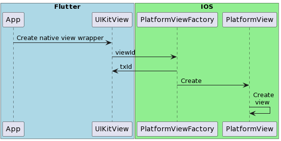
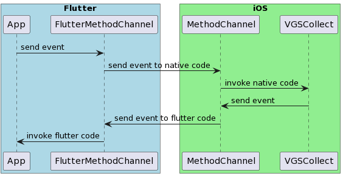
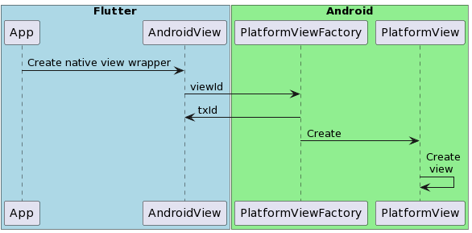
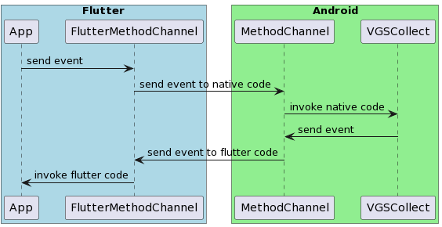

# README

This demo shows how to integrate VGS Collect [iOS](https://github.com/verygoodsecurity/vgs-collect-ios) and [Android](https://github.com/verygoodsecurity/vgs-collect-android) SDK into your [Flutter](https://flutter.dev/) app.
VGS don't have official Flutter package. You can easily integrate VGS Collect SDK into your mobile crossplatform Flutter apps.

# Table of contents

<!--ts-->

- [Run application](#run-application)
- [Run VGSShow use case](#run-vgsshow-use-case)
- [iOS VGSCollect integration guide](#ios-vgscollect-integration-guide)
- [Android VGSCollect integration guide](#android-integration-guide)
- [Flutter integration guide](#flutter-integration-guide)

<!--te-->

## Run application

1. Required environment:

- Installed <a href="https://flutter.dev/docs/get-started/install" target="_blank">Flutter</a>
- Setup <a href="https://flutter.dev/docs/get-started/editor?tab=androidstudio" target="_blank">IDEA</a>
- Setup <a href="https://flutter.dev/docs/get-started/install/macos#install-xcode" target="_blank">Xcode</a>
- Install <a href="https://cocoapods.org/" target="_blank">Cocoapods</a> for running iOS
- Organization at <a href="https://www.verygoodsecurity.com/">VGS</a>

> **_NOTE:_** Please visit Flutter <a href="https://flutter.dev/docs" target="_blank">documentation</a>
> for more detailed explanation how to setup Flutter and IDEA.</br>
> This sample is compatitable with Flutter 3.3.4 version.</br>
> Check Flutter issues <a href="https://github.com/flutter/flutter/issues" target="_blank">here.</a>

2. Install Flutter packages

```bash
flutter pub get
```

3. `cd` to `ios` folder and run

```bash
  pod install
```

4. `cd` to `lib/utils`. Find `constants.dart` file and set your `vault_id` and `environment`

```dart
class CollectShowConstants {
  static const vaultID = 'vault_id';
  static const environment = 'sandbox';
}
```

5. Run flutter app:\
   On iOS Simulator (<a href="https://flutter.dev/docs/get-started/install/macos#set-up-the-ios-simulator" target="_blank">Run iOS app Flutter docs</a>).\
   On Android Simulator (<a href="https://docs.flutter.dev/get-started/install/macos#set-up-the-android-emulator" target="_blank">Run Android app Flutter docs</a>).

6. In case of possible issues a common fix is to clean project and reinstall packages:

```bash
  flutter clean
  flutter pub get
```

7. In case of error in VS Code `Flutter VsCode error: You don't have an extension for debugging YAML` please check [this answer:](https://stackoverflow.com/a/68949816)

Click on "open a file", then navigate to the main.dart file and then click debug and run.

<p align="center">
   
   &nbsp; &nbsp; &nbsp; &nbsp; &nbsp; &nbsp;
   
</p>

## Run VGSShow use case

Check [VGSShow use case here](https://github.com/vgs-samples/vgs-collect-show-flutter-demo/tree/master/lib/presentation/pages/collect_show).

## iOS VGSCollect integration guide

Integration to Flutter project can be separated into two parts.

<b>Implementing PlatformView wrappers for native iOS views:</b>

<p align="center">
	
</p>

<b>Implementing MethodChannel for communication between dart and native code:</b>

<p align="center">
    
</p>

1. Add dependencies into your `Podfile` in `ios` folder:

```ruby
target 'Runner' do
  # Comment the next line if you don't want to use dynamic frameworks
  use_frameworks!

  # Pods for Runner

  pod 'VGSCollectSDK'
  pod 'VGSShowSDK'
  pod 'VGSCollectSDK/CardIO'

end
```

Make sure deployment minimal iOS version of your target and project is set to `iOS 10` or later in iOS [project settings](https://stackoverflow.com/a/61335546). Run:

```bash
  pod update
```

For `CardIO` include `NSCameraUsageDescription` key in iOS project `info.plist` to enable Camera in your iOS application.

```xml
    <key>NSCameraUsageDescription</key>
    <string>Camera usage description</string>
```

2. Review official
   Flutter [documentation](https://docs.flutter.dev/development/platform-integration/platform-channels)
   how to integrate native and Flutter code.

3. Check our [implementation](https://github.com/vgs-samples/vgs-collect-show-flutter-demo/tree/master/ios/Runner/UseCases/CustomCardData/CollectView).

| File                                          | Description                                                                                                                          |
| --------------------------------------------- | ------------------------------------------------------------------------------------------------------------------------------------ |
| CustomCardDataCollectView.swift               | Native iOS UIKit view, holds UI and VGSTextFields.                                                                                   |
| FlutterCustomCardDataCollectView.swift        | Holds Flutter Platform view implementation, VGSCollect instance and configuration. Encapsulates FlutterMethodChannel implementation. |
| FlutterCustomCardDataCollectViewFactory.swift | Platform view factory.                                                                                                               |
| FlutterCustomCardDataCollectViewPlugin.swift  | Flutter plugin.                                                                                                                      |

## Android integration guide

Integration to Flutter project can be separated into two parts.

<b>Implementing PlatformView wrappers for native Android views:</b>

<p align="center">
	
</p>

<b>Implementing MethodChannel for communication between dart and native code:</b>

<p align="center">
    
</p>

1. Add dependencies into your `android/app/build.gradle`:

```groovy
dependencies {

    implementation 'com.verygoodsecurity:vgscollect:latest_version'
    implementation 'com.verygoodsecurity:vgsshow:latest_version'
    implementation 'com.verygoodsecurity:adapter-cardio:latest_version'
}
```

2. Review official
   Flutter [documentation](https://docs.flutter.dev/development/platform-integration/platform-channels)
   how to integrate native and Flutter code.

3. Check our [implementation](https://github.com/vgs-samples/vgs-collect-show-flutter-demo/tree/master/android/app/src/main/kotlin/com/verygoodsecurity/vgs_collect_flutter_demo).

| Package                                                         | Description                                                  |
| --------------------------------------------------------------- | ------------------------------------------------------------ |
| com.verygoodsecurity.vgs_collect_flutter_demo                   | Root package.                                                |
| com.verygoodsecurity.vgs_collect_flutter_demo.view              | All platform views and factories.                            |
| com.verygoodsecurity.vgs_collect_flutter_demo.view.collect      | Platform view and factory used in custom example.            |
| com.verygoodsecurity.vgs_collect_flutter_demo.view.collect_show | Platform views and factories used in collect & show example. |

## Flutter integration guide

For iOS and Android you need to create Flutter wrappers depending on platform.

```dart
  Widget _cardCollectView() {
    if (Platform.isAndroid) {
      return _cardCollectNativeAndroid();
    } else if (Platform.isIOS) {
      return _cardCollectNativeiOS();
    } else {
      throw Exception('Platform is not supported!');
    }
  }

  Widget _cardCollectNativeiOS() {
    final Map<String, dynamic> creationParams = <String, dynamic>{};
    return Column(children: [
      SizedBox(
          height: 290.0,
          child: UiKitView(
              viewType: customCardDataCollectViewType,
              onPlatformViewCreated: _createCardCollectController,
              creationParams: creationParams,
              creationParamsCodec: StandardMessageCodec()))
    ]);
  }

  Widget _cardCollectNativeAndroid() {
    // Pass parameters to the platform side.
    final Map<String, dynamic> creationParams = <String, dynamic>{};

    return SizedBox(
      height: 300,
      child: AndroidView(
        viewType: customCardDataCollectViewType,
        onPlatformViewCreated: _createCardCollectController,
        layoutDirection: TextDirection.ltr,
        creationParams: creationParams,
        creationParamsCodec: const StandardMessageCodec(),
      ),
    );
  }
```

Check our [implementation](https://github.com/vgs-samples/vgs-collect-show-flutter-demo/tree/master/lib/presentation/pages/custom_card_data).

| File                             | Description                                                    |
| -------------------------------- | -------------------------------------------------------------- |
| custom_card_data_controller.dart | Holds Flutter method channel and method invocation logic.      |
| custom_card_data.dart            | Holds Flutter platform views with collect card data page demo. |
